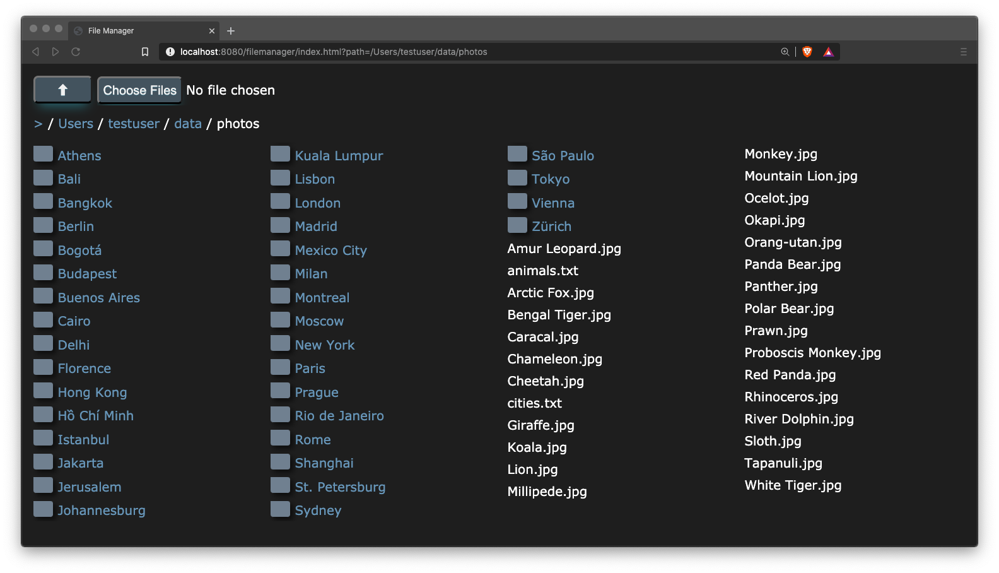

# filemanager

A file manager providing browser-based file up- and download to a hosting server.

[filemanager](https://github.com/mike-seger/filemanager/) comes in two flavors:
- a [library](library), which can be used as a maven dependency to a Spring Boot application
- a standalone [application](application), based on the library

filemanager contains a browser client, compatible with modern browsers.
The server part of filemanager is a simple java servlet served by a Spring Boot application.
It exposes the host file system to the browser client.

## Features

### Server
- Expose file system of any major hosting OS through a REST/JSON API

### Client 
- Compatible with any modern browser
- Navigation of host file system
- File up- and download
- Directory download as ZIP file
- Responsive multi column file list

## System Requirements

### Server

The server is compatible with any OS providing with Java 1.8+.
It has been successfully tested with the following:

- MacOS 10.15
- Ubuntu 18.04, 20.04
- Windows 7, 10

### Client

The client is compatible with any modern browser.
It has been successfully tested with the following:

- Chrome Version 83.0.4103.116 (Official Build) (64-bit)
- Firefox Version 78.0.1 (64-bit)
- Safari Version 13.1.1 (15609.2.9.1.2)
- Brave Version 1.11.97 Chromium: 84.0.4147.89 (Official Build) (64-bit)

## Sample Screenshots

