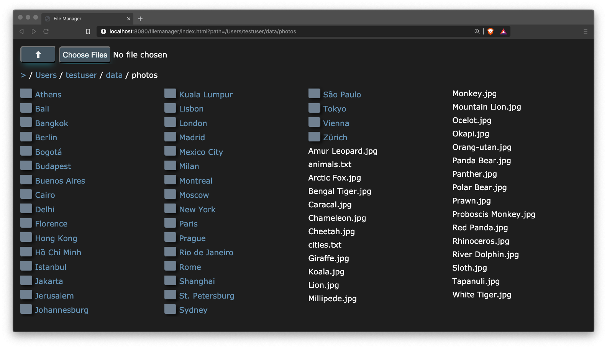
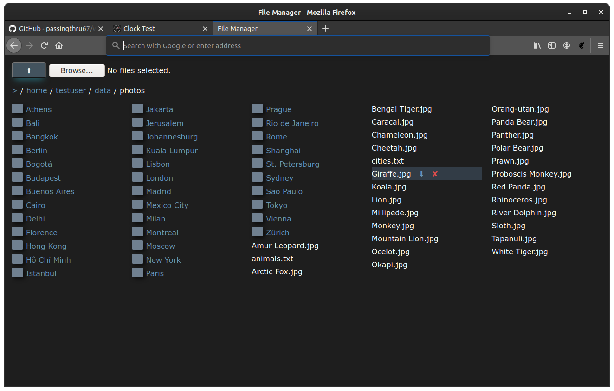
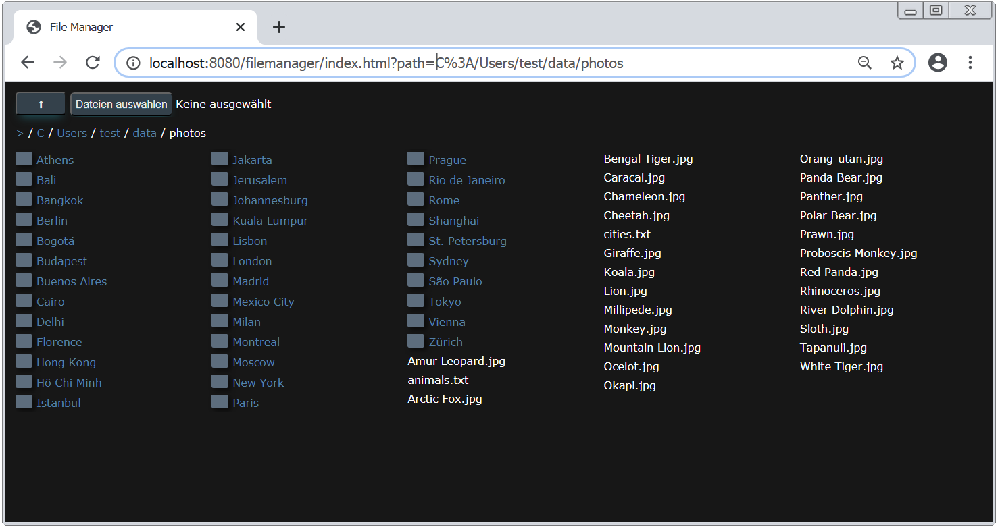

# file-manager

A file manager providing a file system explorer and the capability to up- and download files from/to a host file system.

[file-manager](https://github.com/mike-seger/web-modules/tree/master/file-manager) comes in two flavours:
- A [library](library), which can be included as a dependency in a Spring Boot application
- A standalone sample [application](application), based on the library

file-manager consists of the following components:
- A web page compatible with modern browsers.
- A server component.

## Demo
https://web-modules-file-manager.herokuapp.com/

## Features

### Server
- Expose file system of any major hosting OS through an API

### Client 
- Compatible with any modern browser
- Navigation of host file system
- File up- and download
- Directory download as ZIP file
- Responsive multi column file list

## System Requirements

### Server

The server is compatible with any OS providing Java 1.8+.
It has been successfully tested on the following platforms:

- MacOS 10.15
- Ubuntu 18.04, 20.04
- Windows 7, 10

### Client

The client is compatible with any modern browser.
It has been successfully tested with the following browsers:

- Chrome Version 84.0.4147.89 (Official Build) (64-bit) and (32-Bit)
- Firefox Version 78.0.1 (64-bit)
- Safari Version 13.1.1 (15609.2.9.1.2)
- Brave Version 1.11.97 Chromium: 84.0.4147.89 (Official Build) (64-bit)

## Sample Screenshots

### Mac OS

### Linux

### Windows

