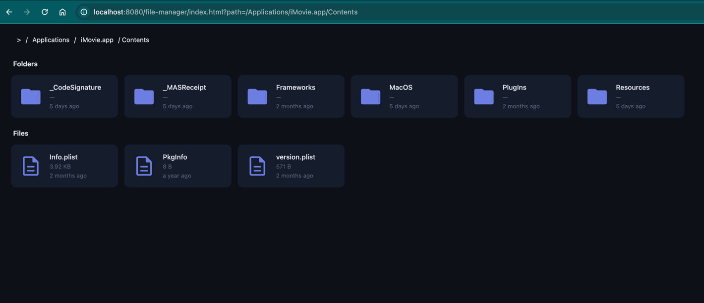

# file-manager

A file manager providing a file system explorer and the capability to up- and download files from/to a host file system.

## Quick Start

```bash
# From the project root directory:
./gradlew :app:file-manager:bootRun
```

Then open [http://localhost:8080/file-manager/index.html](http://localhost:8080/file-manager/index.html) in your browser.

### API

A Swagger UI is available at [Swagger-UI](http://localhost:8080/file-manager/swagger-ui/index.html).

## Overview

[file-manager](https://github.com/mike-seger/web-modules/tree/master/file-manager) comes in two flavours:
- A [library](../../lib/file-manager), which can be included as a dependency in a Spring Boot application
- A standalone sample [application](.), based on the library

file-manager consists of the following components:
- A web page compatible with modern browsers.
- A server component.

## Features

### Server
- Expose file system of any major hosting OS through an API

### Client
- Modern dark theme (inspired by [file-browser-modern-theme](https://github.com/Teraskull/file-browser-modern-theme))
- Compatible with any modern browser
- Navigation of host file system
- Drag-and-drop file upload (drop onto the file list or directly onto a folder)
- Visual feedback: green outline when upload is allowed, red when the folder is read-only
- File download and directory download as ZIP
- Mobile upload via floating action button (touch devices)
- Seamless zoom slider with session persistence
- Scroll position persistence per directory

## System Requirements

### Server

Java 17+ on any major OS. Tested on:
- macOS
- Ubuntu
- Windows

### Client

Any modern browser (Chrome, Firefox, Safari, Edge).

## Sample Screenshot


