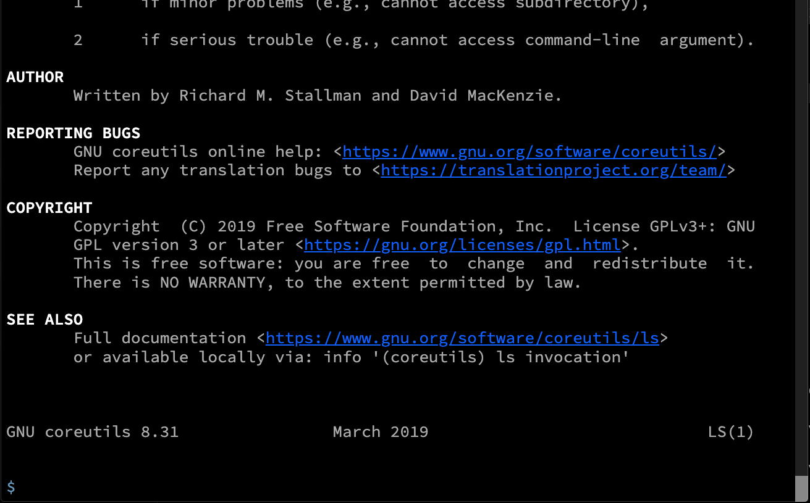

# web-shell

web-shell is a library, which can be used to provide a web based shell to any
Spring Boot application.  
You can can find a sample application using the web-shell library here: 
[application](./application/)
  
A simple application allowing to run host and custom commands on the hosting system.  
It provides server and client in a single web application.



## Features
- A terminal UI is provided by a web page.
- Requires no shell access like SSH.
- Commands are run by the application user in a host shell detected or "raw", if no shell is detected.
- Custom commands can provide additional functionality not available on the host.
- The default implementation of web-shell is based on WebSockets. 
If this is an issue, web-shell has a fallback implementation based on HTTP POST. 
It can be accessed under /terminal/index-rest.html.

## Running
The quickest way to start web-shell locally is to run:
```
mvn spring-boot:run
```
This builds and starts the application.  
Open http://localhost:8080/ and start using.

## Example Instance
https://web-modules-web-shell.herokuapp.com/

## Commands

Enter **help**  or **?** to get the list of custom commands.  
Any command which is not in this list is run as a system call, if it exists. 

## Implementation

The following technologies are used in **web-shell**:
- Java (Spring Boot)
- JavaScript
- WebSockets
- STOMP

**web-shell** has been inspired by this similar implementation: https://github.com/linux-china/xtermjs-spring-boot-starter  
It features Webflux/Rsocket and Webpack integration, but cannot be deployed in a tomcat container, due to the Webflux dependency.

## Limitations

- Streaming command results, such as in ```tail -f <file>``` is not supported. Every command returns the result as a single result. 
- applications which require user input (such as "vi editing") are not supported.

## References
- Spring Boot (https://spring.io/projects/spring-boot)
- Terminal (https://terminal.jcubic.pl)
- SockJS (https://github.com/sockjs/sockjs-client)
- STOMP (https://github.com/jmesnil/stomp-websocket)
